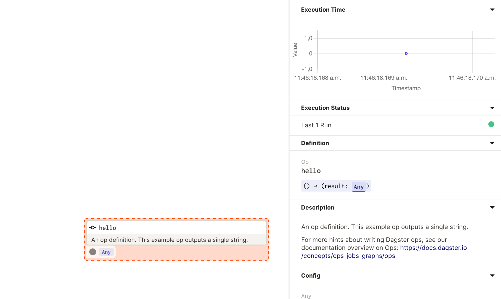
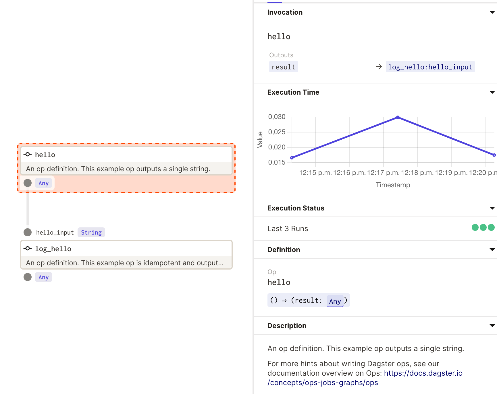
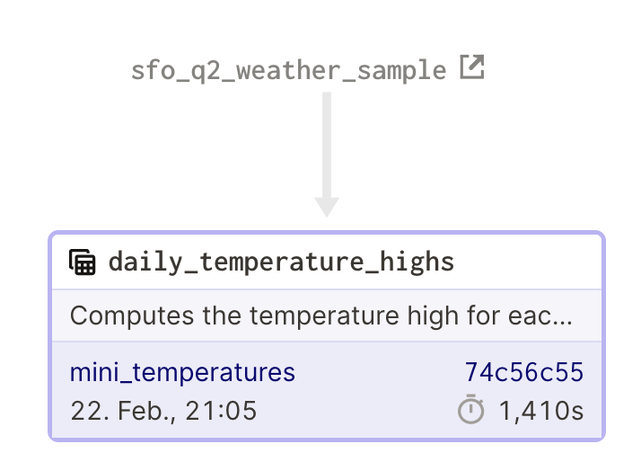
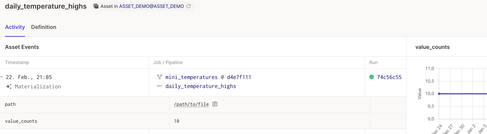
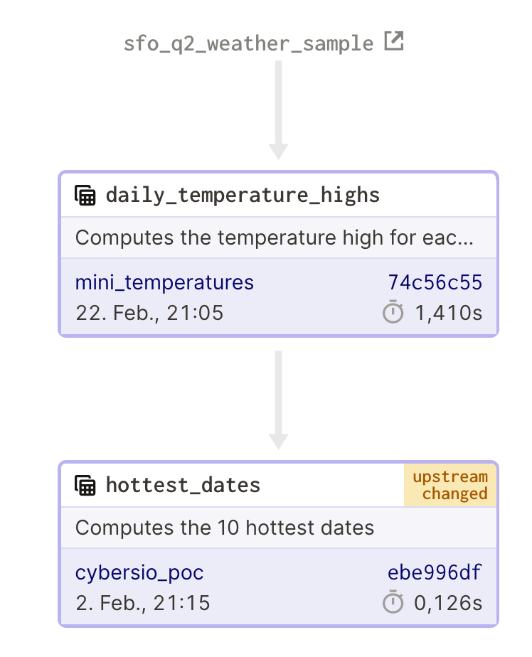
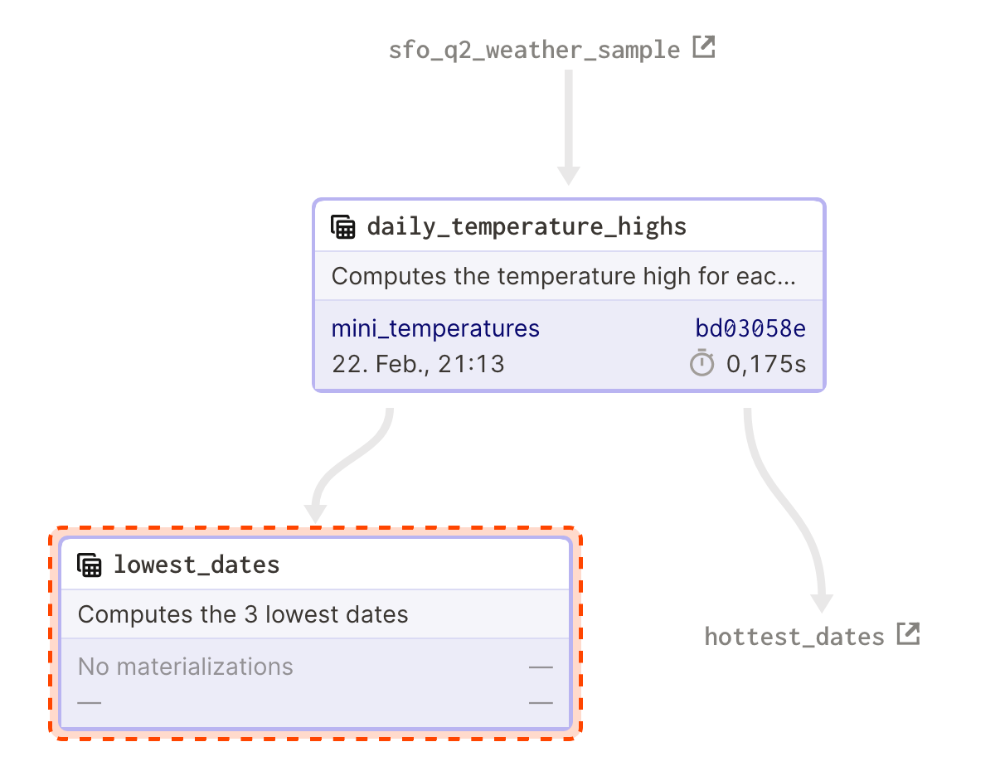
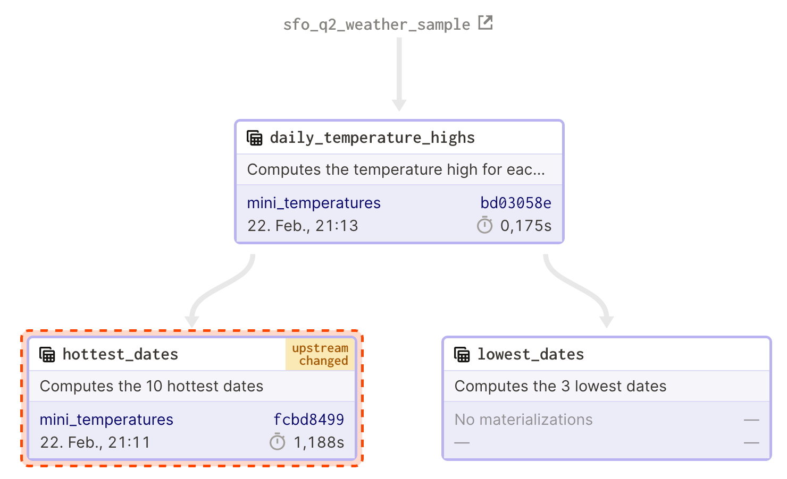
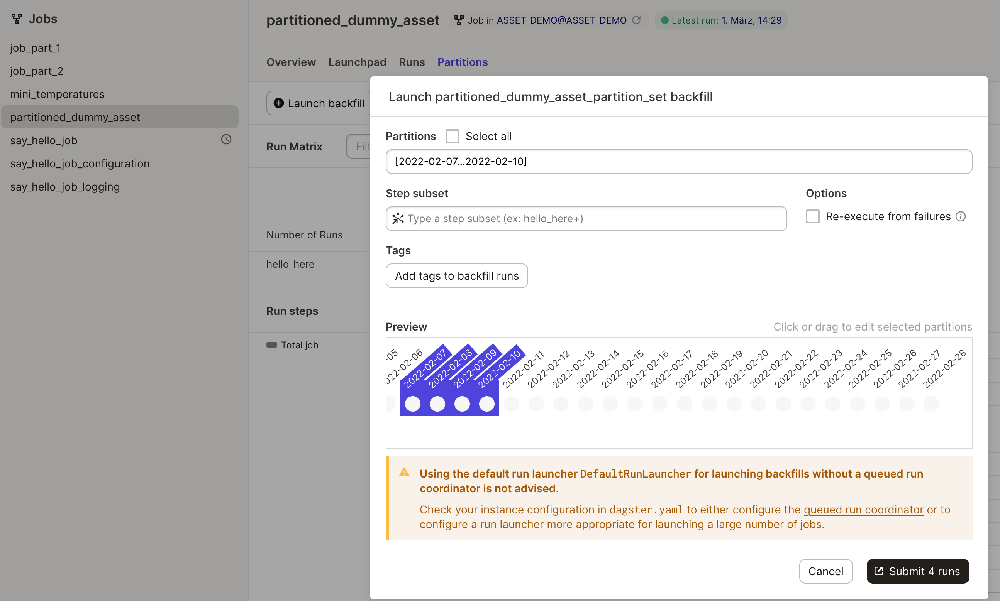
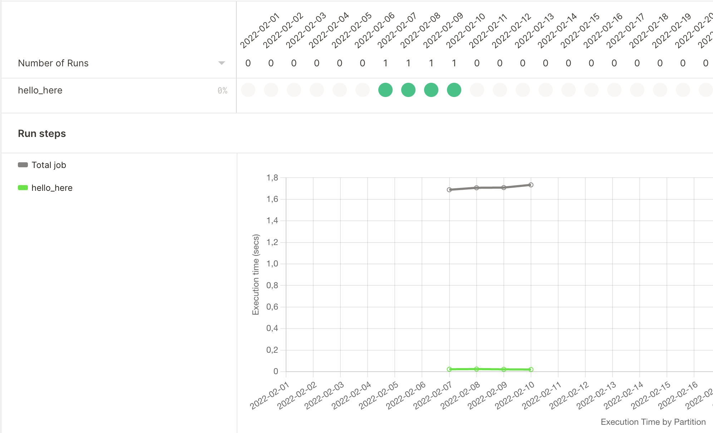

# ASSET_DEMO

Welcome to a dummy example about software-defined-assets in dagster

### using the demo

```bash
git clone ... path to project on your git instance
cd ASSET_DEMO

make create_environment

# follow the instructions below to set the DAGSTER_HOME
# and perform an editable installation (if you want to toy around with this dummy pipeline)
conda activate dagster-asset-demo
pip install --editable .

make dagit
# explore: Go to http://localhost:3000

# optionally enable:
dagster-daemon run
# to use schedules and backfills
```

### walk-through of demo contents

#### hello-world (0)

A simple `say_hello_job` graph with a `hello` function outlines the most basic **hello-world** example.

- go to the launchpad
- run the `say_hello_job`
- take a look of the logs. In particular the nice visualization & structured logging capabilities.
- you will observe how the text: `Hello, Dagster!` is returned as a result (but noting is printed just yet).
- check out the various UI components: https://docs.dagster.io/concepts/dagit/dagit



- furthermore, take not of the:
    - statistics like runtime stats
    - as well as the documentation (parsing of the docstring) describing the function

#### hello-world (1)

- now we log the result when running the `say_hello_job_logging`. 
- as you can observe:
    - there is an additional stage. The results of the first step are passed over into the next step (operation)
    - in the logs you can nicely find the logging message

    

#### hello-world (2) using the structured configuration

- now we log the result when running the `say_hello_job_configuration` the structured configuration accepts a name of a person who will be greeted.
- observe how the configuration can be scaffolded and includes meta information as well as type safety 

> NOTICE: A simple run will fail (try it), as the configuration is not supplied.

Then, for a second try supply the required configuration:

```
ops:
  hello_config:
    config:
      name: "Georg"
```
in the Dagit UI.

> NOTICE: There are multiple possibilities to supply the configuration (CLI, JSON, YAML fragments in the Dagit UI, default configuration in python). To learn about the details read more at: https://docs.dagster.io/concepts/configuration/config-schema and https://docs.dagster.io/tutorial/advanced-tutorial/configuring-ops

> NOTICE: We are using a typesafe configuration here. This means the configuration is not random YAML - but rather conforms to a specific well-defined schema.
> Furthermore, notice how Dagit can now auto-suggest a suitable (but empty) configuration.

There is now a button `Scaffold missing configuration`. Delete the configuration - and have Dagit scaffold it for you.


#### software-defined assets

Conceptually, software-defined assets invert the typical relationship between assets and computation. Instead of defining a graph of ops and recording which assets those ops end up materializing, you define a set of assets, each of which knows how to compute its contents from upstream assets. :smile: derived from https://docs.dagster.io/guides/dagster/software-defined-assets .

This means you start to turn the data pipeline inside out and reason about the things people actually care about: The materialized state and how to manage it, its evolution over time and quality and lineage.

Further reading material:

- https://dagster.io/blog/rebundling-the-data-platform
- https://docs.dagster.io/guides/dagster/software-defined-assets (as of 0.14.1 the API is stable now)
- TODO link future Dagster blog post here (they promised a good one for Thursday)

##### minimal example (A)

We start with a small dummy example

- open the graph: `minimal_assets`
- observe the assets UI (including the job graph)
- see how staleness propagates

Asset lineage from the source:

  

And details about the asset:

    

Here a more complex example including the lineage of two assets where one is marked as stale when the upstream one is updated:

    


##### minimal example with lineage (B)

- temperature example
- combine multiple assets to derive a new asset
- have some *complex* assets in separate graph but still see the big picture

The implicitly shown lineage:

  

... can be expanded to a true full view:

    

#### partitions
##### job of operations example with partitions (C)

> HINT: do not forget to start the dagster-daemon `dagster-daemon run`



> NOTICE: for a production grade setup a more performant run coordinator needs to be configured https://docs.dagster.io/deployment/run-coordinator



Various metrics are collected for each partition.

##### partitioned assets

TODO

##### example with resources (D)

- a more complex-real-world web-scraping example where comments from a forum (hackernews) are downloaded
- using DBT SQL transformations can be handled
- TODO steal the hacker news example

#### further next steps

There are many more topics to cover beyond the scope of this simple introductory tutorial.
In particular:

- IO manager
- external lineage in an enterprise data catalog like https://datahubproject.io/ or
- scheduling
- partitions & backfills
- easy testing of workflows by separating the business logic (semantics) from the underlying platform and resources

The official dagster documentation contains some good examples. 
In particular https://docs.dagster.io/guides/dagster/example_project is a great recommentation to learn more.

### Contents

| Name                     | Description                                                                       |
| ------------------------ | --------------------------------------------------------------------------------- |
| `README.md`              | A description and guide for this code repository                                  |
| `setup.py`               | A build script with Python package dependencies for this code repository          |
| `workspace.yaml`         | A file that specifies the location of the user code for Dagit and the Dagster CLI |
| `ASSET_DEMO/`       | A Python directory that contains code for your Dagster repository                 |
| `ASSET_DEMO_tests/` | A Python directory that contains tests for `ASSET_DEMO`                      |

## Getting up and running

1. Create a new Python environment and activate.

**Pyenv**
```bash
export PYTHON_VERSION=X.Y.Z
pyenv install $PYTHON_VERSION
pyenv virtualenv $PYTHON_VERSION ASSET_DEMO
pyenv activate ASSET_DEMO
```

**Conda**
```bash
export PYTHON_VERSION=X.Y.Z
conda create --name ASSET_DEMO python=PYTHON_VERSION
conda activate ASSET_DEMO
```

2. Once you have activated your Python environment, install your repository as a Python package. By
using the `--editable` flag, `pip` will install your repository in
["editable mode"](https://pip.pypa.io/en/latest/reference/pip_install/?highlight=editable#editable-installs)
so that as you develop, local code changes will automatically apply.

```bash
conda activate dagster-asset-demo
pip install --editable .
```

## Local Development

1. Set the `DAGSTER_HOME` environment variable. Dagster will store run history in this directory.

```base
mkdir ~/dagster_home
export DAGSTER_HOME=~/dagster_home
```

2. Start the [Dagit process](https://docs.dagster.io/overview/dagit). This will start a Dagit web
server that, by default, is served on http://localhost:3000.

```bash
dagit
```

3. (Optional) If you want to enable Dagster
[Schedules](https://docs.dagster.io/overview/schedules-sensors/schedules) or
[Sensors](https://docs.dagster.io/overview/schedules-sensors/sensors) for your jobs, start the
[Dagster Daemon process](https://docs.dagster.io/overview/daemon#main) **in a different shell or terminal**:

```bash
dagster-daemon run
```

## Local Testing

Tests can be found in `ASSET_DEMO_tests` and are run with the following command:

```bash
pytest ASSET_DEMO_tests
```

As you create Dagster ops and graphs, add tests in `ASSET_DEMO_tests/` to check that your
code behaves as desired and does not break over time.

For hints on how to write tests for ops and graphs in Dagster,
[see our documentation tutorial on Testing](https://docs.dagster.io/tutorial/testable).
